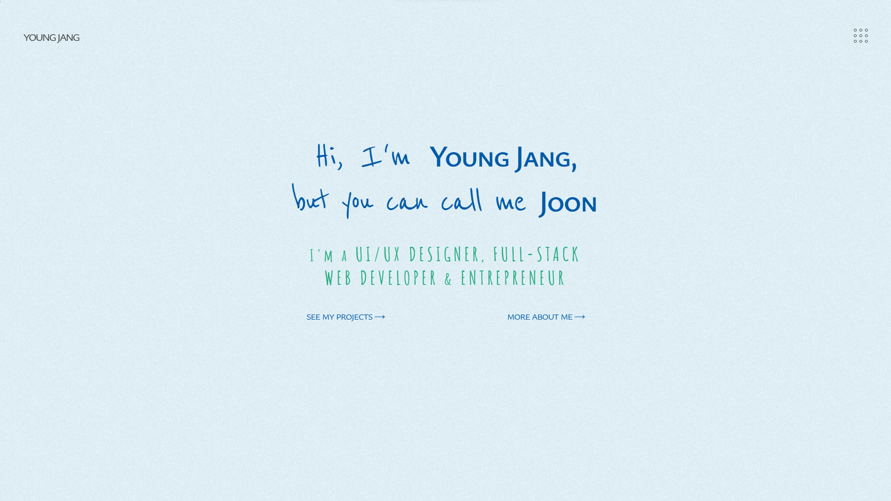

# "Hi, I'm Young Jang" v1

## Description



A portfolio designed using Figma, powered by React and styled-components. Front-end only at this time. All animations are made using CSS and framer-motion. Enjoy.

---

## Table of Contents

- [Installation](#installation)
- [Usage](#usage)
- [Credits](#credits)
- [Collaboration](#collaboration)
- [Questions](#questions)

---

## Installation

You can simply download/clone the app from its repo to install.

To clone, run the following command in your terminal:

```
   git clone https://github.com/jyoungjoon/hiimyoungjang.git
```

To download: Simply click on the download button on the repository on browser and extract.

If you don't feel like installing, that's completely fine, you can just click on the link below to see the deployed app.

---

## Usage

You can simply run the app by opening the github pages link below.

---

## Credits

Thank you, Sharlee, for invaluable UI/UX ideas. As for MJ, you, my dear friend, have been the unwavering pillar of motivation that kept me going. Thank you both!

---

## Collaboration

Please email me for collaborating ideas.

---

## Questions

Please email me or find me on Github for any questions or issues.

Find me on Github: [jyoungjoon](https://github.com/jyoungjoon)

You can also contact me at lifescriptified@gmail.com

---
